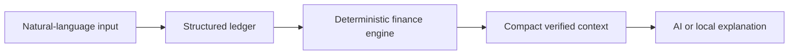

<p align="center">
  
</p>

<p align="center">
  <strong>Know where your money actually goes.</strong><br/>
  Natural language → structured ledger → verified calculations → evidence-based decisions.
</p>

<p align="center">
  <a href="https://your-cfo-finance.ssinazeeh.chatgpt.site">Live client demo</a> ·
  <a href="docs/architecture.md">Architecture</a> ·
  <a href="docs/privacy-security.md">Privacy & security</a> ·
  <a href="docs/public-deployment.md">Deployment</a>
</p>

<p align="center">
  
  
  
  
</p>

## Why Your CFO

Most finance apps show totals. Your CFO focuses on the behavior hidden inside them—small rides, breakfasts, coffee, delivery fees, snacks, games, and convenience purchases that feel harmless alone but become expensive together.

> “You didn’t make one major unnecessary purchase, but 27 small transactions added up to 812 MAD.”

The LLM interprets language and explains verified data. It never owns the arithmetic.

## What the MVP does

- Captures one or several transactions from natural language: `3dh biscuit, 24dh inDrive, 29dh pizza`
- Stores editable amount, currency, type, category, merchant, purpose, date, necessity, recurrence, confidence, and original text
- Keeps monthly income, fixed costs, spending, savings target, actual savings, accumulated capital, and emergency reserves distinct
- Detects cumulative money leaks and projects month-end spending
- Simulates purchase, life-change, and emergency decisions
- Supports isolated personal and shared financial profiles with Owner, Member, and View-only roles
- Works without an AI key through deterministic calculations and local classification
- Optionally enhances explanations through Gemini, Groq, Mistral, or OpenRouter
- Includes an isolated client-demo profile with realistic MAD data, goals, savings pools, and month comparison
- Delivers a responsive premium-fintech interface across desktop and mobile

## Product areas

| Area | Purpose |
| --- | --- |
| **Home** | Five-second view of available cash, income, spending, savings, capital, leaks, and recent activity |
| **Activity** | Searchable ledger with filters, editing, deletion, recurrence, and recategorization |
| **CFO** | Financial questions answered from compact, verified profile aggregates |
| **Plan** | Savings pools, goals, capital, emergency reserve, and three decision simulators |
| **Insights** | Money leaks, small purchases, spending mix, comparisons, trends, and projections |

## Financial architecture



Financial formulas live in `lib/finance.ts`, parsing in `lib/parser.ts`, authorization in `lib/authz.ts`, and provider routing in `lib/ai/providers.ts`. Monetary values are stored as integer minor units—never floating point.

## Technology

- Next.js, React, TypeScript, Tailwind CSS, and Radix UI
- Cloudflare Workers and D1/SQLite
- Drizzle schema and immutable migrations
- Supabase email/password authentication for public deployment
- Server-side AI provider router with graceful local fallback
- Node test runner, ESLint, and TypeScript strict checking

## Run locally

Prerequisites: Node.js 22.13+ and pnpm.

```bash
pnpm install
pnpm db:generate
pnpm typecheck
pnpm lint
pnpm test
pnpm build
```

Copy `.env.example` to `.env` only when authentication or an external AI provider is needed. Core finance calculations work without an AI key.

```env
GEMINI_API_KEY=your_key_here
GEMINI_MODEL=gemini-3.5-flash-lite
```

## Demo scenario

The built-in **Client Demo** profile contains 10,000 MAD income, 4,000 MAD fixed expenses, a 2,000 MAD monthly savings target, 20,000 MAD capital, an 8,000 MAD emergency reserve, and 27 small purchases totaling exactly 812 MAD. Open it from the profile selector or during onboarding.

## Security and privacy

- Password handling is delegated to Supabase Auth; API keys remain server-side.
- Every financial query is scoped through profile membership and role checks.
- External AI receives only the minimum aggregated context needed for the question—not the full ledger.
- Same-origin validation, server-side input validation, daily AI limits, and precise integer money storage are included.

This is an MVP financial organization tool, not a bank or regulated financial adviser. See [privacy and security notes](docs/privacy-security.md) for the exact guarantees and limitations.

## Current limitations

- Shared-profile permissions are enforced, but the invitation UI is not yet included.
- Recurring items are modeled but not automatically generated on a schedule.
- Local classification is rule-based and should expand from profile-specific corrections.
- Reports are currently in-app; PDF/CSV export is a future milestone.

## Next milestone

Build a privacy-preserving correction-learning loop so each profile’s local classifier improves before an external AI provider is called.

---

Built by [Ilyas Nazih](https://ilyasnazih.nztech.ma) — IT Automation & Digital Systems Builder.
